# AI architecture

## Role of AI

AI supports teaching, explanation, analysis, and recommendation. It does not
replace Beaver AI's authoritative domain logic, content review, permission
checks, or safety policy. A feature should use deterministic logic when rules
are sufficient and AI only when uncertainty or language understanding creates
real educational value.

## Architectural boundary

All model use flows through an application-owned AI orchestration boundary.
Clients and domain entities do not call providers directly.

```mermaid
flowchart LR
    UseCase[Application use case] --> Policy[Authorization + AI policy]
    Policy --> Context[Context builder]
    Context --> Guard[Minimization + input safeguards]
    Guard --> Gateway[Model gateway]
    Gateway --> Provider[Approved provider]
    Provider --> Validate[Output validation + safety]
    Validate --> Result[Typed proposal / tutor response]
    Result --> Evaluate[Telemetry + evaluation]
```

The boundary owns:

- purpose-specific task definitions and typed input/output contracts;
- provider and model routing;
- minimal context assembly and retrieval;
- prompt/template versioning;
- tool allowlists and argument validation;
- policy, safety, timeout, budget, and rate controls;
- output parsing, citation checks, and confidence/fallback handling; and
- privacy-aware observability and evaluation metadata.

## Context hierarchy

Context should be assembled in this order and only as needed:

1. governing safety and educational policy;
2. the current authorized task and learning objective;
3. reviewed curriculum/content relevant to the task;
4. minimal learner state such as goals, recent evidence, and support level;
5. bounded session history; and
6. permitted tool results.

Retrieved content is data, not instruction. External text, uploads, and student
messages may contain prompt injection and must not override system policy or
gain tool permissions.

## Authority and provenance

AI outputs fall into explicit classes:

- **Conversational content:** displayed with suitable framing and session
  provenance.
- **Proposal:** recommendation, feedback, misconception hypothesis, tag, or
  draft requiring validation and, when risk warrants, review.
- **Extraction:** structured interpretation tied to its source and confidence.
- **Prohibited direct write:** permissions, published curriculum, final
  high-stakes score, mastery truth, consent, or reward balance.

Promotion from a proposal to authoritative data uses an application workflow
with deterministic validation and recorded provenance. The model itself never
decides its authority.

## Tutor behavior principles

The tutor should:

- help the learner reason before revealing a final answer when appropriate;
- adapt explanations without lowering the learning objective invisibly;
- state uncertainty and ask clarifying questions when needed;
- ground claims in approved content or identify when it is relying on general
  model knowledge;
- avoid fabricating learner history, sources, grades, or guarantees;
- protect student dignity and avoid fixed labels;
- redirect self-harm, abuse, sexual, dangerous, or other sensitive situations
  according to reviewed policy; and
- provide a graceful non-AI path or handoff when a safe, useful answer is not
  available.

## Tools and actions

Model-requested tools use least privilege:

- each task receives an explicit allowlist;
- tool arguments are schema-validated and authorization is rechecked outside
  the model;
- read results are minimized before returning to the model;
- writes require application invariants and may require user confirmation or
  human review;
- side effects are idempotent where retries are possible; and
- tool name, decision, outcome, and safe metadata are auditable.

No arbitrary code execution, database query, network access, or unrestricted
content retrieval is exposed to a model.

## Safety and privacy

- Do not send data to a model unless the provider, purpose, retention,
  training-use setting, region, and deletion path are approved.
- Use pseudonymous internal references when identity is unnecessary.
- Keep credentials, hidden configuration, unrelated profile data, and other
  learners' information out of prompts.
- Treat transcripts and student work as sensitive student data.
- Apply age-appropriate policies and crisis/escalation flows based on the
  supported launch population and jurisdiction.
- Avoid using raw student interactions for model training or evaluation without
  an approved legal basis, policy, minimization, and consent where required.
- Red-team prompt injection, data leakage, unsafe guidance, manipulation,
  stereotyping, cheating assistance, and over-reliance.

## Quality and evaluation

An AI feature needs an evaluation plan before release:

### Offline

- curated representative cases with age, subject, ability, and language range;
- correctness, grounding, citation, pedagogical quality, calibration, tone, and
  policy adherence;
- adversarial and abuse cases;
- comparison to deterministic or no-AI baselines; and
- regression gates tied to versioned prompts, models, retrieval, and policies.

### Online

- task completion and learning-oriented outcomes;
- safety events, escalations, refusals, fallbacks, and complaints;
- latency, availability, and cost;
- sampled review under strict access and privacy controls; and
- segmented quality and fairness monitoring.

Automated model judging can help triage but is not the sole release gate,
especially for safety or educational correctness.

## Failure behavior

Provider failure must not silently produce invented state. Depending on the
feature, the system should retry within a bound, switch to an approved fallback,
offer reviewed static guidance, preserve the student's work, or explain that
the feature is temporarily unavailable. Circuit breakers and budgets should
prevent cascading failures and uncontrolled spend.

## Change control

Prompts, models, retrieval policies, tool definitions, safety rules, and output
schemas are versioned application dependencies. Changes require review,
evaluation, rollout/rollback plans proportionate to risk, and traceability to
observed output. Provider model aliases must not cause an unreviewed model
upgrade.

## Decisions deferred to implementation phases

Provider and model selection, retrieval technology, transcript retention,
human-review operations, age-specific tutor policy, and model-routing strategy
remain open. Phase 8 owns the text-tutor implementation, but earlier AI use must
adopt this boundary and complete the same risk review.
