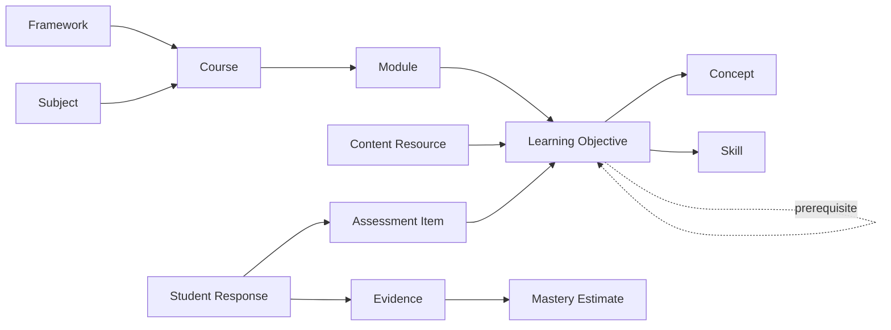

# Domain model

## Purpose

This conceptual model establishes shared language and ownership. It is not a
physical database schema. Cardinality, fields, and aggregate boundaries must be
refined with use cases in the phase that implements each area.

## Modeling principles

- Model educational meaning separately from how it is displayed or packaged.
- Do not force all curricula into one rigid tree.
- Preserve content and definition versions so historical learning evidence
  remains interpretable.
- Distinguish observed evidence from inferred state.
- Represent uncertainty; avoid false precision in mastery or recommendations.
- Keep authoritatively reviewed data separate from AI proposals.
- Minimize student data and attach purpose, provenance, and lifecycle.

## Curriculum and learning structure

The initial conceptual structure is a **versioned directed graph with curated
hierarchies**, not a single chain from education level to assessment.

### Core concepts

- **Framework:** an educational standard, curriculum, or exam specification
  that gives external context.
- **Subject:** a broad discipline such as mathematics or biology.
- **Course:** a coherent program of study for an audience, framework, or goal.
- **Module:** an ordered or grouped course segment; units and chapters are
  presentation labels for this concept.
- **Learning Objective:** a reviewable statement of what a learner should be
  able to know or do.
- **Concept:** a unit of declarative understanding, such as equivalent
  fractions.
- **Skill:** an observable capability, such as comparing fractions with unlike
  denominators.
- **Prerequisite Relation:** a directed, qualified relation indicating that one
  objective, concept, or skill supports another.
- **Content Resource:** instructional material that addresses one or more
  objectives. A lesson is one resource format or composed learning experience.
- **Assessment Item:** a task that can elicit evidence about one or more
  objectives or skills.

Education level, grade band, difficulty, subject, framework, and intended
audience are classifications or contexts; they are not assumed to be permanent
parent-child levels. Topic and lesson are useful navigation/content concepts,
but neither defines the atomic unit of mastery.

The diagram omits versions and many-to-many cardinalities for readability.

## Learner and learning model

- **Account:** authentication-facing identity. It is not the learner profile.
- **Learner:** the subject whose learning is being supported.
- **Learner Profile:** goals, preferences, declared context, and approved
  accommodations used for personalization.
- **Enrollment or Learning Plan:** a learner's relationship to a course or
  goal, with status and intended path.
- **Learning Activity:** a planned or completed learning interaction.
- **Attempt:** a learner's participation in an activity or assessment session.
- **Response:** work submitted for a particular task or prompt.
- **Learning Evidence:** an immutable or append-oriented interpretation of an
  observation relevant to an objective, including source, time, conditions,
  scoring method, and confidence.
- **Mastery Estimate:** a derived, time-specific estimate for a learner and
  objective, with uncertainty and model/version provenance.
- **Misconception Hypothesis:** a derived, uncertain explanation supported by
  evidence; never a permanent label on a student.
- **Recommendation:** a time-limited proposed next action with rationale,
  inputs, policy/model version, and disposition.
- **Review Need:** a derived indication that retained knowledge should be
  checked or refreshed.

Completion, correctness, evidence, mastery, and retention are distinct.

## Tutoring model

- **Tutor Session:** bounded interaction linked to a learner, purpose, and
  approved context scope.
- **Turn:** one participant or system contribution with role and provenance.
- **Context Package:** the minimal, policy-filtered bundle supplied to a model.
- **Tutor Tool Action:** a validated request for authoritative application
  information or a permitted application operation.
- **Safety Decision:** a policy result that may allow, transform, redirect,
  escalate, or block an interaction.
- **Tutor Evaluation:** structured quality and safety evidence about a response
  or session.

Model output is conversation content or a proposal. It does not directly become
mastery, curriculum, profile, reward, or permission data.

## Rewards and social model

Future concepts include:

- **Reward Transaction:** immutable ledger entry for XP or BBucks; balances are
  derived.
- **Achievement Award:** evidence that defined achievement criteria were met.
- **Quest:** a learning-aligned goal with transparent conditions.
- **Challenge:** a scoped comparison or shared activity with eligibility,
  privacy, and fairness rules.
- **League or Leaderboard:** a moderated cohort and ranking view, not a public
  exposure of minors by default.

Rewards reference verified domain events and must not own educational truth.

## Ownership summary

| Truth | Owning module |
| --- | --- |
| Identity and access grants | Identity and Access |
| Learner goals and preferences | Learner Profile |
| Published objective and prerequisite definitions | Curriculum |
| Published instructional resource versions | Content |
| Attempts, responses, and learning evidence | Learning Record / Practice |
| Mastery estimates and review state | Mastery |
| Recommendation records and rationale | Personalization |
| Tutor transcript and evaluations | Tutor |
| Reward ledger | Rewards |

Detailed boundaries between Learning Record, Mastery, and Practice must be
settled in Phases 5–6 based on concrete transaction and querying needs.

## Invariants to preserve

- Historical evidence points to the exact objective/item/content versions used.
- Publishing a new curriculum or content version does not rewrite history.
- Deleting or restricting a learner is consistently propagated to derived data
  and external processors.
- Mastery updates identify their evidence and algorithm version.
- Recommendations identify their inputs and can expire or be superseded.
- AI proposals cannot bypass review/promotion rules for authoritative data.
- Access to one learner never implies access to another learner.

## Language to avoid

Avoid calling an estimate a fact (“the student knows”), treating a low score as
a fixed trait, using “AI-generated” as a quality claim, or conflating course
progress with mastery. Product copy and code should preserve these distinctions.
