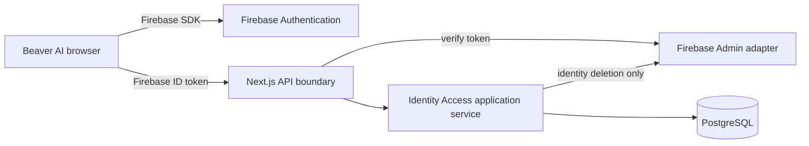

# Identity, accounts, sharing, and authorization

## Status

Implemented in Phase 1. This document describes the current authentication and
application-owned account boundary.

## Responsibility boundary



Firebase Authentication owns credentials, federated provider interaction,
password reset delivery, and authentication sessions. Beaver AI owns accounts,
identity associations, display names, sharing invitations, connections,
permission scopes, lifecycle status, and audit events.

Firebase types are restricted to `src/infrastructure/firebase`. The domain and
application service depend on Beaver AI interfaces and an
`AuthenticatedIdentity` value.

## Authentication flows

### Email and password

1. The browser configures Firebase local persistence.
2. Registration or sign-in occurs through the Firebase Web SDK.
3. Registration requests a Firebase verification email.
4. The browser obtains a Firebase ID token and calls `POST /api/account`.
5. The API verifies the token with Firebase Admin, then creates or synchronizes
   the Beaver AI account transactionally.
6. Protected API calls repeat token verification and account synchronization.

Password reset uses Firebase's reset-email flow and always presents generic UI
confirmation to reduce account discovery.

### Google and account linking

Google uses an explicit account-selection popup. Firebase provider linking is
performed only while signed in from account settings. Beaver AI also enforces a
unique normalized account email and unique Firebase subject:

- a repeated or newly linked Firebase identity synchronizes the existing
  account;
- a different Firebase subject cannot silently claim an existing Beaver AI
  email;
- the UI directs the user to sign in with the existing method and explicitly
  link Google.

The Firebase project must keep the one-account-per-email behavior enabled.

## Account model

`accounts` is the Beaver AI account system of record. It contains an opaque UUID,
current email, optional display name, lifecycle status, and timestamps.
`auth_identities` associates an external issuer/subject with the account and
records only provider IDs and authentication metadata needed for synchronization
and audit.

There is no global parent or educator account role. Every account owns its own
private space. Parent and educator meaning exists in a relationship to a
student-owned account. This prevents global role escalation and supports one
person having different relationships to different students.

Phase 2 will add learner profile data without putting it in the authentication
identity.

## Protected request boundary

Every protected API route:

1. requires an `Authorization: Bearer <Firebase ID token>` header;
2. verifies signature, audience, expiration, and revocation through Firebase
   Admin;
3. synchronizes and checks the application account;
4. validates the request body with a bounded schema; and
5. calls an application use case that enforces ownership or permission.

Client redirects and hidden buttons are user experience controls only. They are
not authorization controls. Expected invalid, expired, revoked, or disabled
identities receive a non-sensitive authentication error. Firebase Admin
credential and service failures remain internal server errors rather than being
misreported as invalid user sessions.

## Sharing model

Sharing is private by default and follows:

```text
student creates invitation
→ recipient signs in with matching verified email
→ invitation is atomically accepted
→ scoped active connection is created
→ every shared-resource request checks that active scope
→ student revokes
→ authorization immediately fails
```

### Invitations

An invitation records owner, intended email, relationship type, scopes, state,
expiry, acceptance/revocation time, and audit metadata. The raw 256-bit token is
returned once for delivery by the student; only its SHA-256 hash is persisted.
The token expires after seven days.

Possessing a token is not ongoing authorization. Acceptance requires an
authenticated Beaver AI account whose verified Firebase email matches the
invitation. Tokens are single-use because accepted or revoked invitations
cannot be accepted again.

Phase 1 intentionally has no email-delivery provider. The account UI exposes
the one-time link for private delivery by the student.

### Connections

A connection records:

- student owner account;
- recipient account;
- parent or educator relationship type;
- explicit permission scopes;
- source invitation;
- active/revoked status and timestamps.

Current scopes are `learning_time`, `learning_activity`, `academic_progress`,
`concept_summary`, and `improvement_areas`. Educator relationships do not
receive `learning_time`. No Phase 1 API exposes learning data; these scopes are
the contract future modules must require. PostgreSQL check constraints mirror
the scope allowlist and reject self-referential connections so future write
paths cannot silently bypass these invariants.

There are deliberately no scopes for private AI conversations, personal notes,
credentials, account settings, or unrelated profile information.

## Authorization policy

`IdentityAccessService.authorizeStudentResource` implements the reusable policy:

- the student owner is allowed;
- otherwise an active connection must match owner, recipient, and required
  scope;
- missing, ungranted, or revoked relationships are denied.

Future learning modules call this policy from their server-side use cases. They
must not query connection tables directly or infer access from a relationship
label.

Only the student owner can create invitations or revoke owner-granted access.

## Account deletion

Deletion requires authentication within the previous five minutes.

1. The account is marked `deleting`.
2. Active incoming and outgoing connections and pending owned invitations are
   revoked transactionally.
3. Firebase Admin deletes the authentication identity.
4. Beaver AI purges the account; foreign-key cascades remove identities,
   invitations, and connections.

Once marked `deleting`, normal synchronization and protected account use are
denied. If an external deletion step fails, the account remains disabled for a
safe operational reconciliation rather than becoming active with partially
deleted data. Phase 1 does not include an automated reconciler or internal
operator tool. Final retention and backup-erasure policy remains a
pre-production legal and operational decision.

## API surface

| Route                             | Method         | Purpose                                          |
| --------------------------------- | -------------- | ------------------------------------------------ |
| `/api/account`                    | `GET` / `POST` | Synchronize and return the current account       |
| `/api/account`                    | `PATCH`        | Update the current account display name          |
| `/api/account`                    | `DELETE`       | Delete the current account and Firebase identity |
| `/api/sharing/invitations`        | `GET`          | List owned/received sharing state                |
| `/api/sharing/invitations`        | `POST`         | Create a scoped invitation                       |
| `/api/sharing/invitations/:id`    | `DELETE`       | Revoke a pending owned invitation                |
| `/api/sharing/invitations/accept` | `POST`         | Accept with token and verified email             |
| `/api/sharing/connections/:id`    | `DELETE`       | Revoke an active owned connection                |

Responses containing account or sharing state use `Cache-Control: no-store`.

## Known operational boundaries

- Production requires PostgreSQL, Firebase Web App configuration, and Firebase
  Admin credentials or workload identity.
- The credential-free `verify:phase1:emulator` suite exercises Firebase Admin
  verification/deletion and the complete application lifecycle locally; it
  does not validate production credential permissions or real Google popup
  behavior.
- This phase does not select a deployment platform, mail provider, or
  distributed rate-limiting service.
- Firebase and PostgreSQL cannot participate in one atomic transaction. The
  deletion state machine fails closed; production operations must monitor and
  reconcile accounts that remain in `deleting`.
- Audit records are application security history, not a finalized legal
  retention system.
