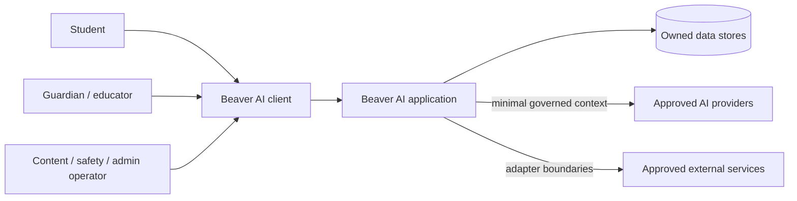

# System architecture

## Status and intent

The Phase 1 system implements the initial web/API modular monolith, Identity and
Access module, Firebase Authentication adapter, and PostgreSQL persistence.
Modules assigned to Phase 2+ remain target architecture only.

## Architecture posture

Start with a **web-first, API-backed modular monolith** organized by business
capability. Keep module ownership and contracts explicit, and extract an
independent service only when measured operational, scaling, security, or team
ownership needs justify it.

This posture minimizes distributed-system overhead while preserving credible
evolution paths. See [ADR-0002](../decisions/0002-evolutionary-modular-monolith.md).

## System context

Parent and educator sharing relationships now exist in Identity and Access;
their learning views remain future scope. Clients never receive direct database
or Firebase Admin credentials. The application verifies Firebase ID tokens and
enforces authorization, policy, provenance, and audit requirements server-side.

## Functional modules

| Module                  | Responsibility                                                            | Introduced |
| ----------------------- | ------------------------------------------------------------------------- | ---------- |
| Identity and Access     | Identities, sessions, roles, consent-facing access rules                  | Phase 1    |
| Learner Profile         | Goals, preferences, accommodations, and profile lifecycle                 | Phase 2    |
| Curriculum              | Educational taxonomy, prerequisites, graph traversal, publication         | Phase 3    |
| Content                 | Lessons, resources, revisions, review, and content delivery               | Phase 4    |
| Learning Record         | Attempts, events, progress views, and learning history                    | Phase 5    |
| Mastery                 | Evidence interpretation, mastery estimates, uncertainty, and review state | Phase 5    |
| Practice and Assessment | Items, sessions, responses, scoring, and feedback                         | Phase 6    |
| Personalization         | Candidate selection, ranking, constraints, and explanations               | Phase 7    |
| Tutor                   | Tutoring sessions, context assembly, tools, policies, and evaluation      | Phase 8    |
| Workspace               | Subject-specific interactive learning tools                               | Phase 9    |
| Work Analysis           | Multimodal submissions, analysis, annotation, and review                  | Phase 10   |
| Voice                   | Real-time speech sessions and voice-specific safety controls              | Phase 11   |
| Rewards                 | XP, levels, BBucks ledger, achievements, quests, and cosmetics            | Phase 12   |
| Social                  | Relationships, challenges, leagues, rankings, and moderation              | Phase 13   |
| Planning                | Test preparation and academic/career exploration                          | Phase 14   |
| Operations              | Administration, support, audit, moderation, compliance, and reliability   | Phase 15   |

Phases identify first ownership, not permission to ignore cross-cutting
requirements until Phase 15. Security, privacy, accessibility, safety,
observability, and testing apply whenever a module is introduced.

## Module boundary rules

- Each domain concept has one authoritative owning module.
- Other modules use the owner's public application contract, not its internal
  persistence model.
- Cross-module writes flow through an application use case; no module mutates
  another module's tables directly.
- Internal events may communicate completed facts. Events are versioned
  contracts, not a substitute for clear synchronous use cases.
- Authorization is enforced server-side at each protected use case.
- User-facing clients contain presentation and interaction logic, not
  authoritative mastery, reward, or access decisions.
- Provider-specific SDKs stay behind adapters so vendor changes do not rewrite
  domain logic.

## Layers within a module

1. **Interface:** HTTP, event, job, or future real-time entry points; validation
   and transport mapping.
2. **Application:** use cases, transaction boundaries, authorization calls, and
   orchestration.
3. **Domain:** rules, entities, value objects, policies, and domain events with
   minimal framework coupling.
4. **Infrastructure:** persistence, queues, provider adapters, telemetry, and
   framework-specific implementation.

This is a dependency direction, not a mandate for four folders in every small
module.

## Technical direction

### Accepted direction

- Web-first responsive client with accessibility designed in.
- Contract-first, type-safe boundaries and runtime validation at untrusted
  inputs.
- Relational storage as the default system of record; graph relationships can
  initially be modeled relationally and measured before adding a graph
  database.
- Durable object storage for future user files and media, isolated from public
  access.
- Background work only for tasks that should not block a request or need
  retries; synchronous flows remain the default.
- Structured observability with redaction and correlation, never raw student or
  tutor content by default.
- Environment-independent configuration and replaceable external adapters.

### Implemented Phase 1 stack

The modular application uses strict TypeScript, Next.js/React, PostgreSQL,
Drizzle ORM, Zod, Firebase Authentication, and Vitest. Firebase is isolated
behind Web SDK and Admin SDK adapters; it is not the Beaver AI account or
authorization system of record. See
[ADR-0005](../decisions/0005-phase-1-application-stack.md) and the
[identity/access architecture](identity-and-access.md).

### Deliberately deferred

- Cloud/deployment platform, AI provider, queue, analytics vendor, mail
  provider, and production operations topology
- Native mobile applications
- Microservices, event streaming platforms, graph databases, vector databases,
  and multi-region infrastructure

Deferred choices require evidence from the phase that first needs them. Vendor
selection must include privacy, retention, residency, safety, portability,
cost, and failure-mode review.

## Integration boundaries

Future integrations—identity, AI, email, storage, analytics, moderation,
speech, search, or curriculum sources—must use narrow interfaces owned by the
calling module. Every integration needs:

- purpose and data-flow documentation;
- allowed data classification and minimization;
- authentication and secret-management design;
- timeouts, bounded retries, idempotency where relevant, and failure behavior;
- provider retention/training settings and deletion support;
- audit and observability requirements; and
- a replacement or degraded-mode strategy proportionate to criticality.

## Deployment evolution

The current deployable shape is one Next.js application, PostgreSQL, and
external Firebase Authentication. No object storage or background worker is
used. Split services or specialized stores only after an architecture decision
records the concrete pressure and migration plan.
