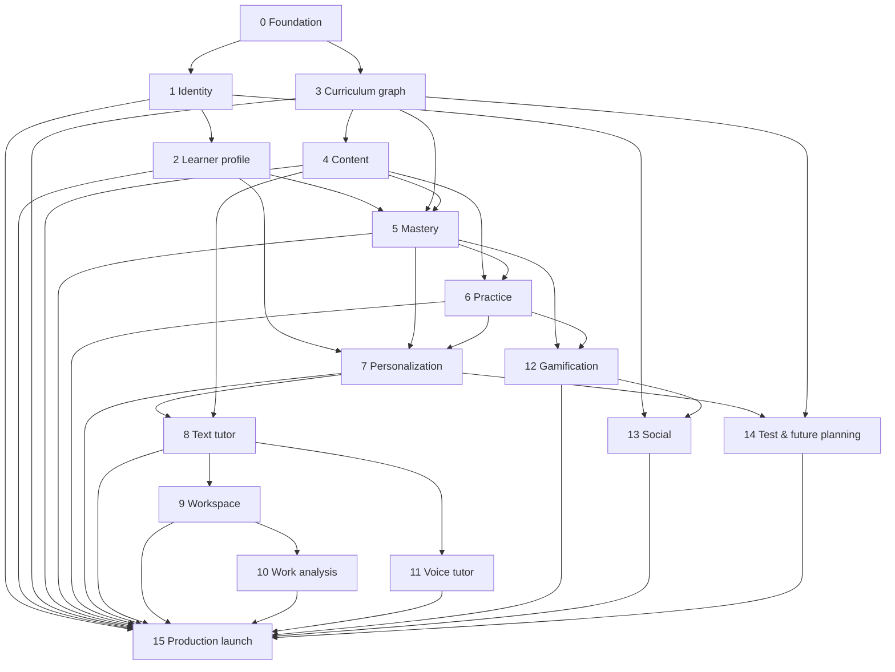

# Product and delivery roadmap

## Roadmap rules

- Phases describe dependency order and product maturity, not fixed dates.
- Phases 0 and 1 are complete in the repository. Phase 2 is the next planned
  product phase; Phase 2+ implementation remains out of current scope.
- A later phase begins only when its prerequisites and entry decisions are
  sufficiently stable; discovery may occur earlier, implementation may not.
- Security, safety, privacy, accessibility, observability, documentation, and
  testing are continuous obligations, not work postponed to Phase 15.
- Each phase updates domain, data, API, threat, operations, and decision
  documentation affected by its implementation.
- Shipping a smaller validated vertical slice is preferred to broad placeholder
  functionality.

## Dependency overview

The graph shows major dependencies, not every cross-cutting relationship.

## Phase 0 — Documentation, Product Definition & Architecture

**Purpose:** establish a coherent source of truth before implementation.

**Major outcomes:**

- product vision, principles, users, experience, scope, and boundaries;
- complete roadmap and dependency direction;
- functional modules, conceptual domain/data model, AI boundary, design
  direction, and technical posture;
- safety, privacy, security, testing, documentation, and development practices;
- architecture decision process and accepted foundational decisions.

**Exit evidence:** the [Phase 0 acceptance review](../phase-0-acceptance.md) is
complete and no Phase 1+ functionality has been implemented.

## Phase 1 — Authentication, Accounts & Permissions

**Status:** implemented; repository, local PostgreSQL, and isolated Firebase
Auth/Admin emulator verification pass. Production credential authorization and
browser-interactive Firebase smoke validation are required before deployment.

**Purpose:** establish secure identity and access foundations.

**Major outcomes:** selected application stack; account lifecycle; secure
authentication and session management; role/relationship-aware authorization
foundation; recovery and security events; baseline deployment/test pipeline;
threat model and privacy-aware audit trail.

**Dependencies:** Phase 0. Before production use, select initial age band,
jurisdiction, account types, guardian/consent needs, and accessibility target.

**Delivered boundary:** Firebase email/password and Google authentication;
Beaver-owned accounts; protected account settings and deletion; student-owned,
scoped parent/educator invitations and connections; server authorization and
audit foundations. No rich learner profile, courses, learning data, or
relationship dashboard was introduced.

## Phase 2 — Student Onboarding & Long-Term Profiles

**Purpose:** understand the learner's goals and approved context without
over-collecting data.

**Major outcomes:** age-appropriate onboarding; goals and preferences; learner
profile lifecycle; consent/guardian flows as required; data controls; initial
learning-plan intent and explainable profile use.

**Dependencies:** Phases 0–1 and decisions about launch audience and consent.

**Boundary:** profile information does not itself claim mastery or generate a
complete adaptive curriculum.

## Phase 3 — Course Catalog & Knowledge Graph

**Purpose:** create reviewed educational structure that future learning,
assessment, and AI features can reference.

**Major outcomes:** frameworks, subjects, courses, modules, objectives,
concepts, skills, prerequisites, versioning, publication workflow, graph
validation, and catalog discovery.

**Dependencies:** Phase 0; Phase 1 for protected authoring/administration.

**Boundary:** defines what can be learned, not lessons, mastery, or personalized
sequencing.

## Phase 4 — Lesson & Content Management

**Purpose:** provide governed, accessible instructional resources mapped to the
curriculum graph.

**Major outcomes:** content/resource model; author-review-publish workflow;
versioned lessons; objective alignment; accessibility metadata; delivery and
revision history; source/licensing provenance.

**Dependencies:** Phases 1 and 3.

**Boundary:** publishing content does not prove that it teaches effectively or
that a learner mastered it.

## Phase 5 — Mastery & Progress Engine

**Purpose:** turn learning evidence into cautious, explainable progress and
mastery estimates.

**Major outcomes:** learning record; evidence model; mastery estimation;
uncertainty and recency; review needs; progress projections; algorithm
versioning; correction/recomputation; student-facing explanations.

**Dependencies:** Phases 2–4 and validated evidence semantics.

**Boundary:** estimates are not permanent labels, grades, or automatic
high-stakes decisions.

## Phase 6 — Practice & Assessment Engine

**Purpose:** collect meaningful evidence through valid practice and assessment.

**Major outcomes:** item bank and versions; item-objective mapping; practice and
assessment sessions; response capture; scoring/feedback; accommodations;
attempt integrity; evidence emission; quality analysis.

**Dependencies:** Phases 3–5.

**Boundary:** avoid claiming formal psychometric validity or high-stakes testing
without separate validation.

## Phase 7 — Personalized Curriculum Engine

**Purpose:** recommend useful next learning and review actions from goals,
curriculum constraints, and learning evidence.

**Major outcomes:** candidate generation; prerequisite and goal constraints;
ranking; review scheduling; learner controls; recommendation rationale;
exploration/fallback rules; versioned policies and evaluation.

**Dependencies:** Phases 2–6.

**Boundary:** personalization recommends and adapts; it must not create an opaque
path the student cannot understand or influence.

## Phase 8 — Text-Based AI Tutor

**Purpose:** deliver safe, context-aware, pedagogically useful text tutoring.

**Major outcomes:** model gateway; context builder; grounded retrieval; tutoring
policy; session/turn model; constrained tools; citations/provenance; safety
flows; evaluation and fallback; reporting and review operations.

**Dependencies:** Phases 1–7, especially reviewed content and explainable
learner context.

**Boundary:** the tutor cannot directly grant permissions, publish content,
declare mastery, or operate as an unrestricted answer bot.

## Phase 9 — Interactive Subject Workspace

**Purpose:** let students reason, create, manipulate, and receive feedback in
subject-appropriate environments.

**Major outcomes:** extensible workspace shell; safe tool/plugin contracts;
math/science/writing or other initial tools; persistence; accessibility;
teacher/tutor context handoff; telemetry and recovery.

**Dependencies:** Phases 4, 6, and 8.

**Boundary:** add a specialized tool only when it materially improves a defined
learning task.

## Phase 10 — Multimodal Work Analysis & AI Annotation

**Purpose:** help learners understand submitted handwritten, visual, document,
or other supported work.

**Major outcomes:** secure upload/capture; media pipeline; extraction and
analysis; spatial annotations; confidence and review; correction workflow;
format/accessibility fallbacks; strict retention and provider controls.

**Dependencies:** Phases 6, 8, and 9.

**Boundary:** analysis remains assistive and uncertain; it does not silently
replace original work or authoritative scoring.

## Phase 11 — Real-Time Voice Tutor

**Purpose:** add natural spoken tutoring with safety and accessibility equivalent
to or stronger than text.

**Major outcomes:** streaming speech interface; interruption/turn handling;
transcripts and controls; latency/fallback strategy; voice safety policy;
consent and recording indicators; captions and non-voice alternative;
cost/quality monitoring.

**Dependencies:** Phase 8 and relevant Phase 9 context; Phase 10 where visual
work is combined.

**Boundary:** voice is an interaction mode, not a weaker-policy route around
text tutor controls.

## Phase 12 — Gamification & BBucks Economy

**Purpose:** reinforce healthy learning behaviors and meaningful progress.

**Major outcomes:** auditable XP and BBucks ledgers; levels; streaks with
forgiving rules; achievements; avatars/cosmetics; quests; anti-abuse controls;
accessibility and opt-down controls; learning-impact evaluation.

**Dependencies:** Phases 5–7 and stable learning events.

**Boundary:** no cash value, gambling-like mechanics, pay-to-win advantage,
punitive loss, or engagement optimization that harms learning.

## Phase 13 — Social Learning & Competition

**Purpose:** support safe, constructive shared learning and bounded competition.

**Major outcomes:** privacy-preserving identity/presence; eligibility and
relationship controls; challenges; leagues/leaderboards; reporting,
moderation, blocking, fairness, abuse prevention, and guardian controls where
required.

**Dependencies:** Phases 1, 2, 12, and mature safety operations.

**Boundary:** no open social network, default public profile for minors, or
unmoderated communication.

## Phase 14 — Test Preparation & Future Planning

**Purpose:** support structured test goals and informed academic, college,
major, and career exploration.

**Major outcomes:** exam blueprints and diagnostics; study plans; timed
practice; readiness with uncertainty; sourced exploration data; planning tools;
career/major simulations; clear limitations and counselor handoffs.

**Dependencies:** Phases 3–8; later workspaces may enrich simulations.

**Boundary:** no score, admission, employment, financial, or career guarantee;
planning guidance must distinguish sourced facts from AI suggestions.

## Phase 15 — Administration, Safety, Scaling & Production Launch

**Purpose:** complete operational capabilities and validate the whole product
for a responsible production launch.

**Major outcomes:** administration/support tools; safety and moderation
operations; incident response; compliance readiness for selected jurisdictions;
data-subject/guardian workflows; reliability objectives; load/capacity testing;
backup/disaster recovery; observability; cost controls; deployment security;
launch review and rollback plan.

**Dependencies:** all capabilities included in the launch scope. A product may
launch with a subset of Phases 9–14 only if the roadmap is formally rebaselined;
it may not claim those omitted capabilities.

**Boundary:** Phase 15 hardens and governs earlier features; it does not excuse
shipping those features without baseline safety, privacy, security,
accessibility, and tests in their own phase.

## Cross-phase release gate

Every implemented phase must demonstrate:

- approved scope and explicit non-goals;
- updated domain/data and threat models;
- authorization and privacy review;
- accessibility review for affected experiences;
- automated and exploratory tests proportionate to risk;
- observability and safe failure behavior;
- migration, rollback, and data lifecycle plans where relevant;
- updated user/support and engineering documentation; and
- accepted decisions for durable choices and named owners for remaining risks.
